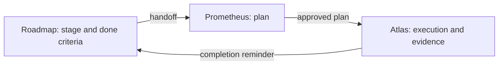

# roadmap guide

English | [简体中文](GUIDE.zh.md)

This guide covers why and when to use roadmap, how to size the work you put into it, and what a typical session looks like. Install steps, the command list and known limitations are in the [README](README.md); every tool action and file rule is in the [reference](REFERENCE.md).

## What roadmap is for

Roadmap keeps the goals and delivery record of one repository as Markdown under `docs/roadmap/`. The agent maintains it through dedicated tools. It answers the questions a single plan can't:

- Why are we doing this, and why now?
- What does this round commit to, and what comes next?
- What has been proven, and what is still owed?

A fresh session can read it and pick up where the last one stopped, so you don't have to explain the project again.

### Who does what

| Piece | Owns |
| --- | --- |
| Roadmap | Goals, stage boundaries, dependencies, done criteria, deferred work, actual outcomes. |
| Prometheus | How one piece of work gets done: research, design, the plan. |
| Atlas | Running an approved plan: delegation, evidence, gates, delivery. |

Roadmap needs the [adr plugin](../adr/README.md), which keeps the architecture decisions that stages cite and link to. Prometheus and Atlas come from the `omo-prometheus` plugin. Roadmap works without it, but the plan features described below need it.



Roadmap never stores implementation plans. They live in Atlas plan bundles, and roadmap reads those bundles when it needs to show which plans exist for a stage.

### What it adds between plans

Inside one plan, Prometheus and Atlas already keep track of the work. Roadmap covers what happens from one plan to the next:

- why the next step is this one;
- what the previous stage actually delivered, how that differs from what was promised, and what limits it left behind;
- whether the plan you're about to approve still fits the round's constraints;
- which findings became commitments with a place in the roadmap;
- where a fresh session should pick up.

### Why not GitHub Projects or Issues

Everything is a file in your repository, so roadmap works without a hosting service and is wired into the agent workflow: handoffs, evidence checks at close, and reminders. It needs a local Git repository, but no remote. A directory that isn't a Git work tree is not supported. Running `git init` there is an option you can choose; roadmap won't do it for you.

### What it guarantees, and what it doesn't

- Closing a stage checks that every current criterion has evidence. It doesn't check that the evidence is true, so the agent has to actually run the checks it reports.
- Closed stages and rounds are frozen, and a closed stage never reopens.
- A completed plan never closes a stage by itself. You or the agent decide whether the stage can close.

## When roadmap fits

The number of plans is a poor test. Ask instead whether the work needs goals, order, decisions and open obligations kept across many executions. Typical cases:

### A large new project

Problem: the first plans go well, and then nobody remembers which parts of the original idea are done, deferred or dropped.

How: run `/init-project` and describe the first round's goal and its stages. Keep later rounds coarse. Give every stage criteria you can check, so each one has a concrete finish line.

### Migrating, upgrading or replacing a system

Problem: compatibility, cutover, rollback and retiring the old path take many steps, and a forgotten one causes trouble later.

How: make compatibility and rollback stages of their own, each with criteria. Put "old path removed" in the last stage's criteria. The [worked example](#a-worked-example) follows this case.

### Long-running product iteration

Problem: each round has a different goal, and deferred ideas pile up with nowhere to go.

How: give each round one product goal. Draft the next round ahead with `/roadmap plan-round`, and keep only that one detailed. A deferred idea becomes a TODO that targets a stage in the round where it belongs, or that names a trigger.

### Tech debt, performance and reliability campaigns

Problem: "make it faster" never ends, and progress is hard to prove.

How: make the first stage a baseline measurement. Give later stages measurable criteria and an explicit stop condition. Work you decide against is recorded as `wontfix` at round close, with the reason, and appears under the round's known limitations.

### Security remediation or audit findings

Problem: you need to know what was fixed, what was verified and which risks were accepted.

How: group findings into stages, with one criterion per finding or per class of finding and a stated verification method. Accepted risks are recorded with their reasons. The record shows what you did; it does not certify compliance.

### From spike to engineering

Problem: the research ends without a decision anyone can find, and the implementation starts from assumptions.

How: make the research a stage whose criterion is a justified decision, usually an ADR. Link the ADR to the stage: the stage cannot close while a linked ADR is still proposed, and the implementation stages that depend on it cannot start until it closes.

### Taking over an old project, or coming back after a break

Problem: you don't remember the state, and there is no written history.

How: run `/init-project` with today's code as the baseline and the next round's goal. Leave out rounds that never happened.

## When not to use it

- A fix you'll finish in one session.
- A throwaway experiment that nobody has committed to.
- A busy daily triage queue. Every TODO needs a target stage or a trigger, which suits commitments and gets in the way of an inbox.
- Several independent products or repositories. Each Git root has one roadmap with one active round, so it can't coordinate across repositories.

Work outside the roadmap doesn't need a stage. If you ask for something that overlaps an unclosed stage and the agent notices, it asks once per stage and session whether to use the roadmap, log the request as free work, or treat it as unrelated. Free work adds one line to the stage's log and claims nothing about its criteria.

## Rounds, stages and plans

### Round

A round has one goal you can judge at the end, such as "first users can complete the core flow". At most one round is active. You can plan future rounds ahead; keep the next one detailed and the rest coarse. When you close a round you record whether the goal was met (`achieved`, `partial`, `not_achieved` or `cancelled`) with a summary. Format-2 repositories require it (see [Repository format 2](#repository-format-2)).

### Stage

A stage is a result you can verify on its own, such as "a user can log in and see their data". Splitting by layer ("backend, then frontend, then tests") works badly, because none of those parts can be judged finished alone.

A stage usually has two to six done criteria, each stating what must pass and how it is verified. Declare a dependency only for a real prerequisite. A stage can't start until its dependencies are closed.

### Plan

A plan is the concrete route to some or all of a stage's criteria, and several partial plans can share one stage. Each plan names the criteria it owns in one line:

```text
Roadmap criteria: DC1, DC3
```

Prometheus checks the line when the plan is proposed, before you're asked to approve it. For a plan bound to a stage, the line is required, lists at least one ID, and may list only IDs the stage currently has. The stage handoff shows which criteria earlier plans already cover, so the next plan can take what's left.

If you know from the start that a stage holds several large, independent pieces, split the stage. Several plans per stage suit work whose parts come naturally one after another, and remediation or replanning after something failed.

### Sizing rules of thumb

| Situation | Suggestion |
| --- | --- |
| Stages per round | Three to eight. More than about ten usually means the round holds two goals. |
| Five to eight plans in total | One round is enough. |
| More than that | An active round, one detailed planned round, and coarse rounds after it. |

## A worked example

You're replacing an authentication system. That takes six or more plans, so you split it into two rounds. Planned rounds need format 2 (see below).

Round R1, "validate that the new system can replace the old one":

| Stage | Result | Example criteria |
| --- | --- | --- |
| S01 | Current behavior and constraints documented | Every login path of the old system is listed with its callers. |
| S02 | New login path works end to end | A test user logs in and reaches protected data through the new path. |
| S03 | Rollback rehearsed | Switching back to the old path succeeds on a staging copy, with the time recorded. |

Round R2, "switch safely":

| Stage | Result |
| --- | --- |
| S04 | Identity mapping between old and new accounts |
| S05 | Small-cohort switch |
| S06 | Full switch and old-path removal |

You create R1 with `/init-project`, draft R2 with `/roadmap plan-round`, and ask the agent to add S04 to S06 to R2 (it calls `roadmap_stage` with `action: "add"` and `round: "R2"`). While working on S02, the agent finds that password reset behaves differently in the new system. The work is real but belongs elsewhere, so the agent records a TODO with `roadmap_todo` that targets S05. When you close R1, that open TODO moves into R2's TODO document automatically, because its target is in a planned round, and it keeps its ID. It shows up again in the S05 handoff.

S02 might need two plans: one for the login backend that declares `Roadmap criteria: DC1`, and a later one for the client that declares `Roadmap criteria: DC2, DC3`. S02 can close once every criterion has passing evidence from either plan.

## The workflow, step by step

1. Initialize. Run `/init-project`, which works for existing projects too: describe today's baseline and the next round's goal. Nothing is written until you confirm the preview.
2. Shape the stages. Write each one as a verifiable result with criteria and real dependencies. Draft later rounds with `/roadmap plan-round` and keep them coarse.
3. Pick the next stage. `roadmap_status` and the status the agent sees every turn list which stages can start now and which unclosed dependencies the others wait on. Roadmap works this out from the documents each time and stores nothing extra, so you can simply ask the agent.
4. Start the stage, then plan. Starting binds the session to the stage and returns a handoff; then plan with `/prometheus`. The handoff contains the round's goal, constraints and non-goals; what the stages it depends on or follows actually delivered and where they deviated; open TODOs; cited ADRs; and the plans that already exist for the stage with the criteria they cover. The new plan declares its own criteria in its `Roadmap criteria:` line.
5. Route changes while you work.

   | What changed | Where it goes |
   | --- | --- |
   | The stage's scope or criteria | A stage amendment (`amend`) with a reason. |
   | Work for later | A TODO. |
   | An architecture decision | An ADR, through the adr plugin. |
   | Small unrelated work | Free work. |

   If the stage changes after a plan was approved, roadmap and Atlas show a notice so you can recheck the plan. Execution doesn't pause.
6. Triage what execution finds. Before Atlas can release the plan, every out-of-scope finding needs a disposition: a Roadmap TODO, a duplicate, or won't fix. The final report lists them for your review.
7. Evaluate the close. When a plan completes, the session that ran it gets a reminder showing how every criterion is covered across all plans, which plans are unfinished, and any drift notices. Closing needs passing evidence for every current criterion, from any plan. You can close while a linked plan is still unfinished; roadmap warns you and records it under Deviations in the stage Outcome.
8. Close the round. Once every stage is closed or dropped, run `/roadmap close-round`. Record the goal outcome, mark each remaining TODO `resolved`, `wontfix` or `carried`, and decide on the next round. `/roadmap new-round` confirms a planned round's goal with you again before it activates it.

## Everyday requests

Most of the time you talk to the agent in plain language. Requests that work well:

- "Read the roadmap, tell me which stages can start now and recommend the next one based on goals and risk. Don't write a plan yet."
- "Start S04. Check the round constraints, what predecessor stages actually delivered, and the current code before detailed planning."
- "This plan is done. Evaluate whether S04 can close against its done criteria; list what is not yet proven and what should be deferred."
- "Before closing the round, compare the round goal with what the stages delivered and tell me whether it was achieved."

Initialization and round-level changes (planning, opening, dropping, retargeting) always need an explicit command from you and a confirmed preview, so the agent can't make them alone. The format-2 upgrade also waits for you: it is written only after you answer Yes in its dialog or run `/roadmap upgrade`.

## Repository format 2

Planned rounds, target dates and round goal outcomes need repository format 2. A repository that never uses them stays on format 1, byte for byte.

- In a format-1 repository, the main session asks whether to upgrade each time you start or switch to a session. Yes upgrades at once; No closes the question and changes nothing. The agent may also ask when a task needs format 2.
- `/roadmap upgrade` works at any time. Without dialogs (no UI, or headless), you get one notice naming that command instead.
- After the upgrade, **roadmap 0.2.3 and earlier can no longer read the repository**. Closed history is not rewritten.
- Closing a round in a format-1 repository offers the upgrade first. If you skip it, the round closes without a goal outcome; if you upgrade, you record one. Format 2 always requires it.

If others work in the same repository with roadmap 0.2.3 or earlier, have them update the plugin before you upgrade.

## Limits, and what roadmap doesn't do

Roadmap has no boards, story points, velocity, automatic scheduling, milestone entity or issue-tracker sync, by design. It allows one active round at a time, never reopens a closed stage, and never closes a stage because a plan finished. It needs a local Git repository. It checks that evidence exists; whether the evidence is true is up to whoever ran the checks.

The [README](README.md#known-limitations) lists the known limitations. The [reference](REFERENCE.md) covers tool actions, edit protection, recovery and the directory format.
