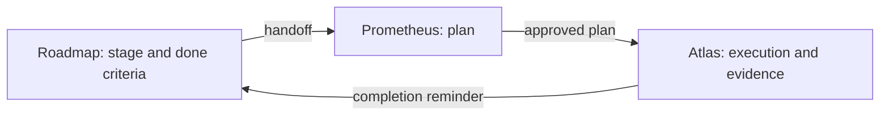

# roadmap guide

English | [简体中文](GUIDE.zh.md)

This guide explains why and when to use roadmap, how to size the work you put into it, and what a typical session looks like. For install steps, the command list and known limitations, see the [README](README.md). For every tool action and file rule, see the [reference](REFERENCE.md).

## What roadmap is for

Roadmap is the record of project goals and delivery for one repository, kept as Markdown under `docs/roadmap/` and maintained by the agent through dedicated tools. It answers questions that a single plan can't:

- Why are we doing this, and why now?
- What does this round commit to, and what comes next?
- What has been proven, and what is still owed?

It is the cross-plan, cross-session memory of the project. A fresh session can read it and know where things stand without you re-explaining the project.

### Who does what

| Piece | Owns |
| --- | --- |
| Roadmap | Goals, stage boundaries, dependencies, done criteria, deferred work, actual outcomes. |
| Prometheus | How one piece of work gets done: research, design, the plan. |
| Atlas | Reliable execution of an approved plan: delegation, evidence, gates, delivery. |

Prometheus and Atlas come from the `omo-prometheus` plugin. Roadmap works without it, but the plan-related features below need it.



Roadmap isn't a bigger Prometheus and isn't a second Atlas. It never stores implementation plans. Plans live in the Atlas plan bundles; roadmap reads them when it needs to show which plans exist for a stage.

### What it adds between plans

The value shows up between plans, not inside one:

- Why the next step is this one.
- What limits the previous stage left behind, and what it actually delivered versus what was promised.
- Whether the plan you're about to approve still fits the round's constraints.
- Which findings turned into commitments instead of getting lost.
- How to resume in a fresh session.

### Why not GitHub Projects or Issues

Roadmap has no hosting lock-in. Everything is files in your repository, so it works in a plain local repository and is part of the agent workflow: handoffs, evidence-gated close and reminders. It needs a local Git repository but no remote and no hosting service. A plain directory that isn't a Git work tree is not supported. If you want to use roadmap there, running `git init` is an option you can choose; roadmap won't do it for you.

### What it guarantees, and what it doesn't

- Closing a stage checks that evidence is complete for every current criterion. It doesn't check that the evidence is true. The agent has to run the checks it reports.
- Closed stages and closed rounds are frozen. A closed stage never reopens.
- A completed plan never closes a stage automatically. You or the agent evaluate the close.

## When roadmap fits

The test isn't "I'll have five plans". It's this: does the work need goals, order, decisions and open obligations kept across many executions? If yes, roadmap helps. Typical cases:

### A large new project

Problem: the first plans go well, then nobody remembers which parts of the original idea are done, deferred or dropped.

How: run `/init-project` and describe the first round's goal and its stages. Keep later rounds coarse. Each stage gets criteria you can check, so "done" isn't a feeling.

### Migrating, upgrading or replacing a system

Problem: compatibility, cutover, rollback and retiring the old path span many steps, and a forgotten one hurts later.

How: make compatibility and rollback explicit stages with their own criteria. Put "old path removed" in the last stage's criteria so it can't be forgotten. The [worked example](#a-worked-example) below follows this case.

### Long-running product iteration

Problem: every round has a different goal, and deferred ideas pile up with no destination.

How: one round per product goal. Plan the next round ahead with `/roadmap plan-round`, but keep only the next one detailed. A deferred item becomes a TODO with a target stage in the round where it belongs, or with a trigger.

### Tech debt, performance and reliability campaigns

Problem: "make it faster" has no end, and progress is hard to prove.

How: make the first stage a baseline measurement. Write later stages with measurable criteria and an explicit stop condition. Anything you decide not to do goes in as `wontfix` at round close, with the reason.

### Security remediation or audit findings

Problem: you need to know what was fixed, what was verified and what was accepted as a risk.

How: group findings into stages, with a criterion per finding or per class, and the verification method spelled out. Risks you accept are recorded with a reason. This is a record of your work, not a compliance certification.

### From spike to engineering

Problem: a research effort ends without a decision anyone can find, and the implementation starts on assumptions.

How: make the research its own stage whose criterion is a justified decision, usually an accepted ADR kept by the [adr plugin](../adr/README.md). Implementation stages depend on it, so they can't start until the decision is closed out.

### Taking over an old project, or coming back after a break

Problem: you don't remember the state, and there is no written history to rely on.

How: run `/init-project` and describe today's code baseline and the next round's goal. Don't backfill a fictional history of rounds that never existed.

## When not to use it

- A fix you'll finish in one session.
- A throwaway experiment with no commitment attached.
- A high-churn daily triage queue. Roadmap records commitments, not an inbox.
- Several independent products or repositories. There is one roadmap per Git root and one active round, so cross-repository coordination doesn't fit.

Not everything needs a stage. When you ask for work outside the roadmap while a stage is open and the agent notices the overlap, it asks once per stage and session whether to use the roadmap, log the request as free work, or treat it as unrelated. Free work adds a line to the stage's log and claims nothing about its criteria.

## Rounds, stages and plans

### Round

A round has one goal you can judge at the end, for example "first users can complete the core flow". At most one round is active. You can plan future rounds ahead, but keep only the next one detailed and leave the rest coarse. At close you record whether the goal was achieved (`achieved`, `partial`, `not_achieved` or `cancelled`) with a summary; this is required in format-2 repositories (see [Repository format 2](#repository-format-2)).

### Stage

A stage is an independently verifiable result, not a layer of the system. "Write the backend, then the frontend, then the tests" is a bad split, since none of those can be judged finished alone. "A user can log in and see their data" is a good one.

A stage typically has two to six done criteria. Each states what must pass and how it will be verified. Declare dependencies only for real prerequisites. A stage can't start until its dependencies are closed.

### Plan

A plan is the concrete route to some or all of a stage's criteria. A stage can be fulfilled by several partial plans. Each plan declares the criteria it owns with one line:

```text
Roadmap criteria: DC1, DC3
```

Prometheus checks this line when the plan is proposed, before you're asked to approve it. If the stage has criteria, the line is required, must list at least one ID and may only list IDs the stage currently has. The stage handoff shows which criteria existing plans already cover, so a new plan can pick up what's left.

If you already know a stage needs several large, independent pieces, consider splitting the stage instead. Several plans per stage fit best when the parts are naturally sequential, or when a remediation or replan is needed after something didn't pass.

### Sizing rules of thumb

| Situation | Suggestion |
| --- | --- |
| Stages per round | Three to eight. More than about ten usually means the round holds two goals. |
| Five to eight plans in total | One round is enough. |
| More than that | An active round, one detailed planned round, and coarse later rounds. |

## A worked example

You're replacing an authentication system. That's six or more plans, so it gets two rounds. Planned rounds need format 2 (see below).

Round R1, "validate that the new system can replace the old one":

| Stage | Result | Example criteria |
| --- | --- | --- |
| S01 | Current behavior and constraints documented | Every login path of the old system listed, with its callers. |
| S02 | New login path works end to end | A test user logs in and reaches protected data through the new path. |
| S03 | Rollback rehearsed | Switching back to the old path completes on a staging copy, with the time recorded. |

Round R2, "switch safely":

| Stage | Result |
| --- | --- |
| S04 | Identity mapping between old and new accounts |
| S05 | Small-cohort switch |
| S06 | Full switch and old-path removal |

You'd create R1 with `/init-project`, then draft R2 with `/roadmap plan-round`, and add S04 to S06 with `roadmap_stage` (`action: "add"`, `round: "R2"`). While working on S02, the agent finds that the password-reset flow behaves differently in the new system. It's real work, but not for this stage. Instead of forgetting it, the agent records a TODO with `roadmap_todo` and targets S05. When you close R1, that open TODO targets a stage in a planned round, so it moves into R2's TODO document automatically and keeps the same ID. When S05 is handed off, the TODO appears there.

S02 might take two plans: one for the login backend that declares `Roadmap criteria: DC1`, a later one for the client work that declares `Roadmap criteria: DC2, DC3`. S02 closes when every criterion has passing evidence from either plan.

## The workflow, step by step

1. **Initialize.** Run `/init-project`. It works for existing projects too: describe today's baseline and the next round's goal. Review the preview and confirm. Nothing is written before that.
2. **Shape the stages.** Write each stage as a verifiable result with criteria and real dependencies. Draft later rounds with `/roadmap plan-round`, and keep them coarse.
3. **Pick the next stage.** `/roadmap` or `roadmap_status` shows which stages can start now and which are blocked, and by which dependencies. This is derived from the documents each time and never stored.
4. **Start the stage, then plan.** Starting binds the session to the stage and returns a handoff. Then plan with `/prometheus`. The handoff includes the round's goal, constraints and non-goals; what the direct predecessor stages (those it depends on or follows) actually delivered and where they deviated; open TODOs; cited ADRs; and the plans that already exist for this stage with their criteria coverage. The plan states which criteria it owns in its `Roadmap criteria:` line.
5. **Route changes while you work.**

   | What changed | Where it goes |
   | --- | --- |
   | The stage's scope or criteria | A stage amendment (`amend`) with a reason. |
   | Work for later | A TODO. |
   | An architecture decision | An ADR, through the adr plugin. |
   | Small unrelated work | Free work. |

   If the stage changes after a plan was approved, roadmap and Atlas show a notice so you can re-check the plan. Nothing is paused.
6. **Triage what execution finds.** Atlas classifies each out-of-scope finding as a Roadmap TODO, a duplicate or won't fix before it will release the plan, and the final report lists them for your review.
7. **Evaluate the close.** When a plan completes, the session gets a reminder with coverage of every criterion across all plans, unfinished plans and drift notices. Closing needs passing evidence for every current criterion, from any plan. Closing while a linked plan is unfinished is allowed. It is warned about, and the fact is recorded in the stage Outcome's Deviations.
8. **Close the round.** Run `/roadmap close-round` once every stage is closed or dropped. Record the goal outcome, dispose of each remaining TODO as `resolved`, `wontfix` or `carried`, then decide the next round. A planned round's goal is re-confirmed before it's activated, via `/roadmap new-round`.

## Everyday requests

You mostly talk to the agent in plain language. Some requests that work well:

- "Read the roadmap, tell me which stages can start now and recommend the next one based on goals and risk. Don't write a plan yet."
- "Start S04. Check the round constraints, what predecessor stages actually delivered, and the current code before detailed planning."
- "This plan is done. Evaluate whether S04 can close against its done criteria; list what is not yet proven and what should be deferred."
- "Before closing the round, compare the round goal with what the stages delivered and tell me whether it was achieved."

Round-level changes (initialization, planning, opening, dropping, retargeting) always need an explicit command from you and a confirmed preview, so the agent can't make them on its own. The format-2 upgrade is never written without your answer either: it happens only after you say Yes in its dialog or run `/roadmap upgrade`.

## Repository format 2

Planned rounds, target dates and round goal outcomes need repository format 2. Repositories that never use these features stay on format 1 byte for byte.

- In a format-1 repository, roadmap asks at every session start or resume whether to upgrade. Yes upgrades immediately. No closes the question and changes nothing. The agent may also ask when its work needs format 2.
- You can upgrade at any time with `/roadmap upgrade`. Without a dialog (no UI or headless), you get one notice naming that command.
- After the upgrade, **roadmap 0.2.3 and earlier can no longer read the repository**. Closed history is not rewritten.
- At round close in a format-1 repository, the close first offers the upgrade. Skip it and the round closes without a goal outcome; upgrade and you record one. Format 2 always requires it.

If you share the repository with people on an older plugin version, upgrade them first.

## Limits, and what roadmap doesn't do

Roadmap deliberately has no boards, story points, velocity, automatic scheduling, milestone entity or issue-tracker sync. It has one active round at a time, never reopens a closed stage and never closes a stage because a plan finished. It needs a local Git repository. It checks that evidence is complete, and truth is the executor's responsibility.

The [README](README.md#known-limitations) lists the known limitations, and the [reference](REFERENCE.md) covers the details of tool actions, edit protection, recovery and the directory format.
