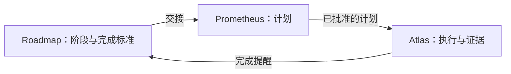

# roadmap 使用指南

[English](GUIDE.md) | 简体中文

这份指南讲清楚为什么用 roadmap、什么时候用、工作该怎么切分，以及一次典型的使用过程是什么样。安装步骤、命令列表和已知限制见 [README](README.zh.md)，每个工具操作和文件规则见[参考文档](REFERENCE.zh.md)。

## roadmap 是做什么的

Roadmap 是一个仓库的项目目标与交付记录，以 Markdown 形式保存在 `docs/roadmap/` 下，由代理通过专用工具维护。单个计划回答不了的问题，它来回答：

- 我们为什么做这件事，为什么是现在？
- 这一轮承诺了什么，接下来是什么？
- 哪些已经被证明，哪些还欠着？

它是跨计划、跨会话的项目记忆。新开一个会话，读一遍就能知道进展到哪了，不用你再把项目讲一遍。

### 分工

| 组件 | 负责 |
| --- | --- |
| Roadmap | 目标、阶段边界、依赖、完成标准、延后的工作、实际结果。 |
| Prometheus | 一件工作怎么做：调研、设计、写计划。 |
| Atlas | 可靠地执行已批准的计划：委派、证据、关口、交付。 |

Prometheus 和 Atlas 来自 `omo-prometheus` 插件。没有它 roadmap 也能用，但下文与计划相关的功能需要它。



Roadmap 不是更大的 Prometheus，也不是第二个 Atlas。它从不保存实现计划。计划存放在 Atlas 的计划包里，roadmap 只在需要展示某个阶段有哪些计划时才去查询。

### 它在计划之间补上了什么

价值出现在计划与计划之间，而不是某个计划内部：

- 为什么下一步是这一步。
- 上一个阶段留下了哪些限制，它实际交付了什么、与承诺有什么出入。
- 你即将批准的计划是否仍然符合本轮的约束。
- 哪些发现变成了承诺，而不是被遗忘。
- 如何在新会话中接着做。

### 为什么不用 GitHub Projects 或 Issues

Roadmap 不绑定任何托管平台。所有内容都是仓库里的文件，所以在普通的本地仓库里就能用，并且是代理工作流的一部分：交接、以证据为前提的关闭、提醒。它需要本地 Git 仓库，但不需要远程仓库，也不需要托管服务。不是 Git 工作树的普通目录不受支持。如果想在那里使用，`git init` 是你可以自己选择的做法，roadmap 不会替你执行。

### 它保证什么，不保证什么

- 关闭阶段时，插件检查每条当前标准的证据是否齐全，不检查证据是否属实。代理必须真的运行它所报告的检查。
- 已关闭的阶段和轮次会被冻结。已关闭的阶段永远不会重新打开。
- 计划完成不会自动关闭阶段。是否关闭需要你或代理去评估。

## 什么时候适合用 roadmap

判断标准不是"我会有五个计划"，而是：这项工作是否需要在许多次执行之间保留目标、顺序、决策和未了结的事项？如果需要，roadmap 就有用。典型场景：

### 大型新项目

问题：前几个计划都很顺利，之后没人记得最初构想里哪些已完成、哪些延后、哪些放弃了。

用法：运行 `/init-project`，描述第一轮的目标和它的阶段。后面的轮次保持粗略。每个阶段都写上可检查的标准，"做完了"就不再只是一种感觉。

### 迁移、升级或替换系统

问题：兼容、切换、回滚、下线旧路径涉及很多步骤，漏掉一步以后会很痛。

用法：把兼容和回滚做成各自带标准的阶段。把"旧路径已移除"写进最后一个阶段的标准，免得被忘掉。下面的[完整示例](#一个完整示例)就是这种情况。

### 长期的产品迭代

问题：每一轮的目标不同，延后的想法越积越多，却没有去处。

用法：一个产品目标对应一轮。可以用 `/roadmap plan-round` 提前规划下一轮，但只把最近的一轮写详细。延后的事项记成 TODO，指向它该去的那一轮的某个阶段，或者设一个触发条件。

### 技术债、性能和可靠性专项

问题："让它更快"没有终点，进展也难以证明。

用法：第一个阶段做基线测量。之后的阶段写可度量的标准和明确的停止条件。决定不做的事，在关闭该轮时以 `wontfix` 记录并写明原因。

### 安全整改或审计发现的修复

问题：需要知道哪些已修复、哪些已验证、哪些作为风险被接受。

用法：把发现分组成阶段，每个发现或每一类发现对应一条标准，并写清验证方法。接受的风险连同原因一起记录。这是你工作的记录，不是合规认证。

### 从调研到工程

问题：调研结束了，却没有人能找到的决策，实现就建立在假设之上。

用法：把调研做成单独的阶段，标准是一个有依据的决策，通常是 [adr 插件](../adr/README.zh.md)维护的一份已接受的 ADR。实现阶段依赖它，所以在这个决策了结之前无法开始。

### 接手旧项目，或长时间中断后重新开始

问题：你不记得现状，也没有书面历史可依赖。

用法：运行 `/init-project`，描述今天的代码基线和下一轮的目标。不要为从未存在过的轮次补写一段虚构的历史。

## 什么时候不该用

- 一个会话就能做完的修复。
- 没有任何承诺的一次性实验。
- 变动频繁的日常分诊队列。Roadmap 记录的是承诺，不是收件箱。
- 多个相互独立的产品或仓库。每个 Git 根目录只有一份路线图、一个活动轮次，所以不适合跨仓库协调。

不是所有事情都需要阶段。某个阶段未关闭时，如果你提出了路线图之外的工作，而代理注意到了重叠，它会针对该阶段在每个会话中问一次：使用路线图、记为自由工作，还是视为无关。自由工作只会在该阶段的日志里加一行，不代表满足了任何标准。

## 轮次、阶段和计划

### 轮次

一轮有一个到最后能判断成败的目标，例如"首批用户能完成核心流程"。同一时间最多一个活动轮次。可以提前规划未来的轮次，但只把最近的一轮写详细，其余保持粗略。关闭时记录目标是否达成（`achieved`、`partial`、`not_achieved` 或 `cancelled`）并写一段摘要；格式 2 的仓库要求必须填写（见[仓库格式 2](#仓库格式-2)）。

### 阶段

阶段是一个可独立验证的结果，而不是系统的一个层次。"先写后端，再写前端，最后写测试"是糟糕的切分，因为其中任何一项单独都无法判断是否完成。"用户能登录并看到自己的数据"才是好的切分。

一个阶段通常有两到六条完成标准，每条写明必须通过什么、怎么验证。依赖只声明真正的前置条件。依赖没有关闭时，阶段无法开始。

### 计划

计划是达成某个阶段部分或全部标准的具体路径。一个阶段可以由多个局部计划共同完成。每个计划用一行声明自己负责的标准：

```text
Roadmap criteria: DC1, DC3
```

Prometheus 会在计划提出时、请你批准之前检查这一行。如果阶段有标准，这一行必须存在，至少列出一个 ID，并且只能列出该阶段当前已有的 ID。阶段交接会显示现有计划已经覆盖了哪些标准，新计划可以接着补剩下的。

如果你一开始就知道某个阶段包含几块庞大且相互独立的内容，应当考虑拆分阶段。每个阶段多个计划更适合这两种情况：各部分天然有先后顺序，或者某些内容没通过、需要补救或重新规划。

### 规模的经验值

| 情况 | 建议 |
| --- | --- |
| 每轮的阶段数 | 三到八个。超过十个左右，通常说明这一轮包含了两个目标。 |
| 总共五到八个计划 | 一轮就够。 |
| 更多 | 一个活动轮次，加一个写详细的计划中轮次，后面的轮次保持粗略。 |

## 一个完整示例

你要替换一套认证系统。这需要六个以上的计划，所以分成两轮。计划中的轮次需要格式 2（见下文）。

R1 轮，"验证新系统能够取代旧系统"：

| 阶段 | 结果 | 标准示例 |
| --- | --- | --- |
| S01 | 记录当前行为与约束 | 旧系统的每一条登录路径及其调用方都已列出。 |
| S02 | 新的登录路径端到端可用 | 测试用户通过新路径登录并访问受保护的数据。 |
| S03 | 完成回滚演练 | 在预发布副本上切回旧路径成功，并记录耗时。 |

R2 轮，"安全切换"：

| 阶段 | 结果 |
| --- | --- |
| S04 | 新旧账号的身份映射 |
| S05 | 小范围用户切换 |
| S06 | 全量切换并移除旧路径 |

你用 `/init-project` 创建 R1，再用 `/roadmap plan-round` 起草 R2，并通过 `roadmap_stage`（`action: "add"`，`round: "R2"`）添加 S04 到 S06。做 S02 时，代理发现密码重置流程在新系统里行为不同。这是真实的工作，但不属于这个阶段。代理没有放过它，而是用 `roadmap_todo` 记下一条 TODO，目标指向 S05。关闭 R1 时，这条未关闭的 TODO 指向计划中轮次的阶段，所以会自动移入 R2 的 TODO 文档，并保持相同的 ID。交接 S05 时，这条 TODO 会出现在里面。

S02 可能需要两个计划：一个做登录后端，声明 `Roadmap criteria: DC1`；稍后一个做客户端，声明 `Roadmap criteria: DC2, DC3`。只要每条标准都有来自任一计划的通过证据，S02 就可以关闭。

## 工作流程，一步一步来

1. **初始化。** 运行 `/init-project`。已有项目同样适用：描述今天的基线和下一轮的目标。检查预览并确认，在此之前不会写入任何内容。
2. **划分阶段。** 把每个阶段写成可验证的结果，附上标准和真正的依赖。用 `/roadmap plan-round` 起草后面的轮次，保持粗略。
3. **选下一个阶段。** `/roadmap` 或 `roadmap_status` 会显示哪些阶段现在可以开始，哪些被阻塞，以及被哪些依赖阻塞。这些信息每次都从文档推导，从不单独存储。
4. **开始阶段，然后做计划。** 开始阶段会把会话绑定到该阶段并返回交接内容。接着用 `/prometheus` 做计划。交接内容包括：本轮的目标、约束和非目标；直接前置阶段（它所依赖或接续的阶段）实际交付了什么、有哪些偏差；未关闭的 TODO；引用的 ADR；以及该阶段已有的计划和它们的标准覆盖情况。计划在 `Roadmap criteria:` 这一行里声明自己负责哪些标准。
5. **工作中把变化放到对的地方。**

   | 变化 | 去处 |
   | --- | --- |
   | 阶段的范围或标准 | 带原因的阶段修订（`amend`）。 |
   | 以后再做的工作 | TODO。 |
   | 架构决策 | ADR，通过 adr 插件。 |
   | 不相关的小事 | 自由工作。 |

   如果阶段在计划批准之后发生了变化，roadmap 和 Atlas 会显示一条提示，方便你重新检查计划。不会暂停任何事情。
6. **处理执行中发现的问题。** Atlas 在释放计划之前，会把每个范围之外的发现归类为 Roadmap TODO、重复项或不予处理，最终报告会列出它们供你审阅。
7. **评估是否关闭。** 计划完成后，会话会收到一条提醒，包含所有计划对每条标准的覆盖情况、未完成的计划和偏移提示。关闭需要每条当前标准都有通过的证据，证据可来自任一计划。有关联计划尚未完成时也允许关闭，但会给出警告，并把这一点记入阶段 Outcome 的 Deviations。
8. **关闭这一轮。** 所有阶段关闭或放弃后，运行 `/roadmap close-round`。记录目标的达成结果，把每个剩余的 TODO 处理为 `resolved`、`wontfix` 或 `carried`，然后决定下一轮。通过 `/roadmap new-round` 激活计划中的轮次之前，会重新确认它的目标。

## 日常可以这样说

你大部分时候是用自然语言和代理交流。下面这些请求效果不错：

- "读一下路线图，告诉我现在哪些阶段可以开始，并根据目标和风险推荐下一个。先不要写计划。"
- "开始 S04。在详细规划之前，先检查本轮的约束、前置阶段实际交付了什么，以及当前的代码。"
- "这个计划做完了。对照完成标准评估 S04 能否关闭，列出还没被证明的部分和应该延后的部分。"
- "关闭本轮之前，把轮次目标和各阶段实际交付的内容对比一下，告诉我目标是否达成。"

轮次级别的变更（初始化、规划、开启、放弃、修改目标日期）始终需要你明确运行命令并确认预览，代理无法自行执行。升级到格式 2 同样不会在你不知情时发生：只有你在对话框里选"是"，或者运行 `/roadmap upgrade`，才会写入。

## 仓库格式 2

计划中的轮次、目标日期和轮次目标结果需要仓库格式 2。从不使用这些功能的仓库会逐字节保持格式 1。

- 在格式 1 的仓库里，roadmap 每次会话开始或恢复时都会询问是否升级。选"是"立即升级；选"否"只是关闭这个询问，不改动任何内容。代理在工作需要格式 2 时也可能询问你。
- 你随时可以用 `/roadmap upgrade` 升级。没有对话框时（无界面或无头模式），你会收到一条点名该命令的提示。
- 升级之后，**roadmap 0.2.3 及更早版本将无法读取该仓库**。已关闭的历史不会被改写。
- 在格式 1 的仓库里关闭一轮时，会先询问是否升级。跳过则这一轮不记录目标结果直接关闭；升级则需要记录。格式 2 始终必须填写。

如果仓库还有人在用旧版本的插件，请先让他们升级。

## 局限，以及 roadmap 刻意不做的事

Roadmap 刻意不提供看板、故事点、速度统计、自动排期、里程碑实体或与问题跟踪器的同步。同一时间只有一个活动轮次，不会重新打开已关闭的阶段，也不会因为计划完成就关闭阶段。它需要本地 Git 仓库。它检查证据是否齐全，证据是否属实则由执行者负责。

已知限制见 [README](README.zh.md#已知限制)，工具操作、编辑保护、恢复和目录格式的细节见[参考文档](REFERENCE.zh.md)。
